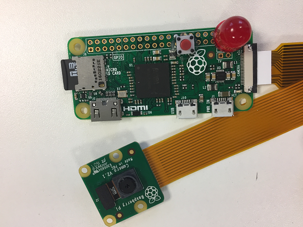
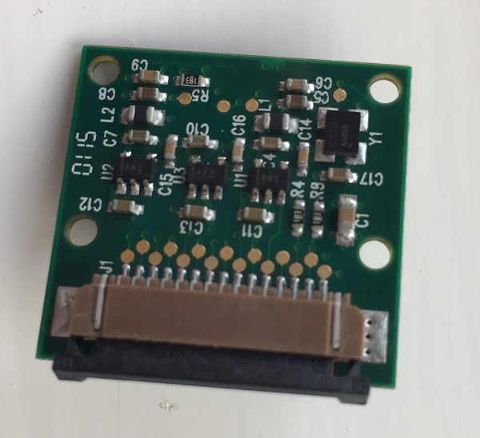
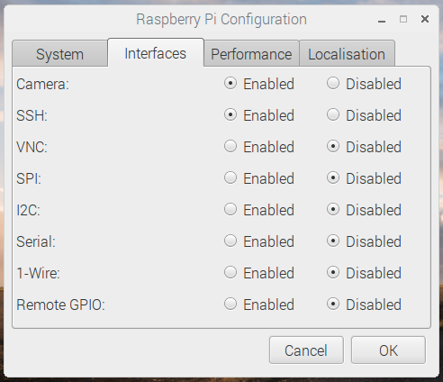

# Raspberry Pi Zero Timelapse Camera

In this resource you will make a wearable timelapse camera using a Raspberry Pi Zero.

## Deciding on your wearable

First, you need to decide what kind of wearable you would like to make. The Raspberry Pi Zero is very small and portable so you can wear it in a variety of different ways. Here are two examples of wearable timelapse cameras you could make with a Raspberry Pi Zero:

1. You could use a lanyard to make a wearable camera that hangs around your neck. Your USB power pack could be stored in a shirt pocket near to the camera.

  

1. You could attach your timelapse camera to a pair of sunglasses so that it can literally see what you see.

  

1. Or, you may have your own idea for how you would like to wear your timelapse camera! The most important thing to remember is that your wearable timelapse camera will *not* be waterproof, so don't wear it outside in the rain (or in the shower).

## Attaching a header to the Raspberry Pi Zero

If you would like to include the optional lights on your wearable using the Blinkt, your Raspberry Pi Zero will need a male header for the Blinkt to attach to, which must be soldered on. (If you don't want to solder, you could try the [hammer header](https://shop.pimoroni.com/products/gpio-hammer-header) instead.)

1. If your header is longer than the number of pins needed, carefully break it off to the right length. Insert the header into the holes in the Raspberry Pi Zero with the longer pins facing upwards.

  

1. Keeping the header pressed in, turn both the Raspberry Pi Zero and the header over. To make soldering easier, put a blob of blue tack under the Raspberry Pi Zero on the long edge opposite the header to keep it level and stop it from moving around whilst you solder. Make sure the Raspberry Pi Zero is flush with the header before beginning to solder.

1. Using a soldering iron, carefully solder each of the pins on the header to the Raspberry Pi Zero, making sure there is enough solder to create a good connection for each one.

  

## Setting up the software

If you are using the optional Blinkt, you will need to install the library code on your Raspberry Pi Zero, which requires an internet connection.

You can either:

- Connect the Raspberry Pi Zero to the internet using a USB to Ethernet dongle
- If you have a Raspberry Pi with an internet connection you could put your SD card into that to install the libraries, then transfer it back to the Raspberry Pi Zero.

Once you are connected to the internet, run the following command in the terminal:

```bash
sudo apt-get install python3-blinkt
```

## Attaching the camera

The Raspberry Pi Zero has a smaller camera port than a standard Raspberry Pi, so you will need a special camera cable with one narrower end to attach the camera for your wearable make. You can see the difference between the two cables below:

  

1. On the PiCamera, locate the clip where the camera cable is attached and pull it up to release the cable. The clip works just like the one you usually use to attach the camera to the Raspberry Pi.

  

1. Insert the wider end of the Raspberry Pi Zero camera cable into the camera, with the exposed metal parts facing towards the front of the camera. Push down the clip to secure the cable in place.

  

1. Pull up the camera clip on the Raspberry Pi Zero and insert the narrower end of the camera cable with the exposed metal parts facing the underside of the Pi Zero. Push down the clip to secure the cable.

  

## Checking your camera

1. Check that your camera is working by opening the terminal and typing the following command:

  ```bash
  raspistill -k
  ```

  1. You should see a camera preview. Press the Enter key to take a picture and exit. If you do not see a camera preview and instead receive an error message, check that your camera is properly connected to the Raspberry Pi Zero. Also ensure that your camera is enabled by opening the Raspberry Pi configuration menu under "Preferences":

    

  1. Check that the camera is set to "Enabled". If it is not, change the setting to "Enabled", press OK and then reboot your Raspberry Pi Zero before trying the first step again.

      

## Coding the timelapse

## Coding the lights

##
